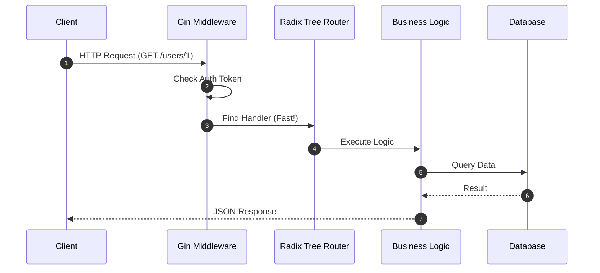
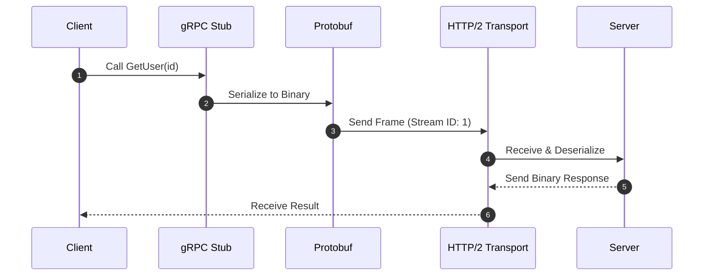
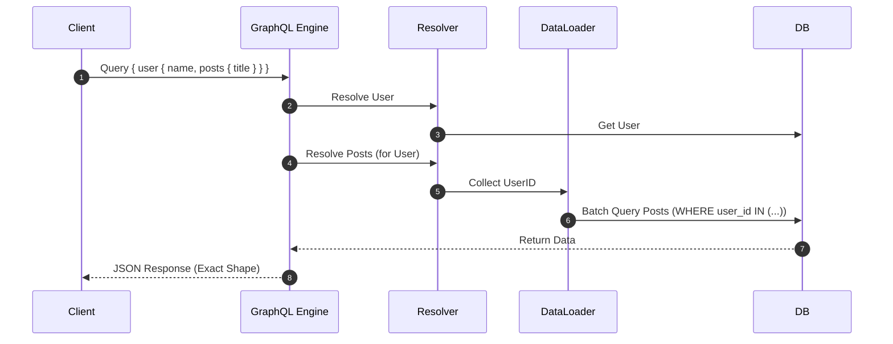

# Go-Journey 🚀
> บันทึกการเดินทางเรียนรู้ภาษา Go ตั้งแต่เริ่มต้นจนถึงระดับสูง (My Personal Golang Learning Path)

Repository นี้รวบรวมตัวอย่างโค้ดและสื่อการเรียนรู้สำหรับภาษา Go (Golang) ที่ผมทำไว้เพื่อศึกษาและทบทวนความรู้ โดยแบ่งเนื้อหาตามระดับความยากและหัวข้อเฉพาะทาง เช่น การพัฒนา API ด้วย Gin Framework

<div>
    
    
    
    
    
</div>

## 🧱 Project Structure

โปรเจคนี้ถูกจัดระเบียบใหม่เป็น 2 ส่วนหลัก ดังนี้:

### 1. Programming-go
รวบรวมเนื้อหาการเขียนโปรแกรมภาษา Go ตั้งแต่พื้นฐานจนถึงระดับสูง
- **basic/**: คอนเซปต์พื้นฐาน
  - Variables, Data Types, Operators
  - Control Flow, Loops, Functions
  - Arrays, Slices, Maps
- **intermediate/**: หัวข้อระดับกลาง
  - Pointers, Structs, Interfaces
  - Error Handling, Defer/Panic/Recover
  - File I/O, JSON Handling
- **advanced/**: หัวข้อระดับสูง
  - Goroutines & Channels

### 2. Gin_framework
เจาะลึกการสร้าง High-Performance API และ Microservices ด้วย **Gin Web Framework**

> **Why Gin?**
> Gin ถูกออกแบบมาเพื่อ **ความเร็ว (Speed)** และ **ประสิทธิภาพ (Performance)** สูงสุด
> - **Technical Insight:** Gin ใช้ **Radix Tree** (โครงสร้างข้อมูลแบบต้นไม้) ในการจัดการ Route แทนที่จะใช้ Regex แบบเดิมๆ ทำให้การค้นหา URL เร็วมาก (O(k)) และใช้ **sync.Pool** เพื่อลดการสร้าง Object ใหม่ซ้ำๆ ช่วยลดภาระของ Garbage Collector (GC)
> - **Concept:** เปรียบเหมือนบรรณารักษ์ที่รู้ตำแหน่งหนังสือทุกเล่มเป๊ะๆ (Radix Tree) ไม่ต้องเดินหาทีละชั้น และมีการนำกล่องใส่หนังสือเก่ามาใช้ซ้ำ (sync.Pool) ไม่ต้องซื้อกล่องใหม่ทุกครั้ง

---

#### 📂 api/RESTful-API
**RESTful API (Representational State Transfer)**
คือมาตรฐานกลางที่ให้โปรแกรมคุยกันผ่าน HTTP (เหมือนภาษาอังกฤษที่เป็นภาษากลางของโลก)

- **Origin & Principle:**
  เกิดจากวิทยานิพนธ์ของ Roy Fielding (ปี 2000) โดยมองทุกอย่างเป็น **Resource** (ทรัพยากร) เช่น User, Product และจัดการผ่าน HTTP Methods (GET=อ่าน, POST=สร้าง, PUT=แก้ไข, DELETE=ลบ)
  
- **Deep Dive:**
  - **Middleware Chaining:** การทำงานแบบ "หัวหอม" (Onion Model) Request จะทะลุผ่านชั้น Middleware (Log -> Auth -> Validation) ก่อนถึง Logic จริง และย้อนกลับออกมา
  - **Stateless:** Server ไม่จำว่าใครส่งมา (No Session) ทุก Request ต้องมีข้อมูลครบถ้วน (เช่น Token) ทำให้ Scale ง่ายมาก

- **Use Cases & Examples:**
  - **เหมาะกับ:** Web/Mobile App ทั่วไปที่โครงสร้างไม่ซับซ้อนมาก
  - **ตัวอย่างจริง:** Twitter API, GitHub API v3, ระบบ E-commerce ทั่วไป
  
- **Pros & Cons:**
  - ✅ **Pros:** เข้าใจง่าย, เครื่องมือเยอะ (Postman, Browser), Caching ง่าย
  - ⚠️ **Cons:** **Over-fetching** (ได้ข้อมูลเกินจำเป็น) และ **Under-fetching** (ต้องยิงหลายรอบกว่าจะได้ข้อมูลครบ)

- **Workflow:**


---

#### 📂 api/Microservices-gRPC
**gRPC (Google Remote Procedure Call)**
คือท่อส่งข้อมูลความเร็วสูงที่ Google พัฒนาขึ้นเพื่อใช้สื่อสารระหว่าง Server ภายใน

- **Origin & Principle:**
  Google ต้องการวิธีสื่อสารที่เร็วกว่า REST จึงสร้าง gRPC ที่ทำงานบน **HTTP/2** และส่งข้อมูลเป็น **Binary** (Protobuf) แทน Text (JSON)
  - **Concept:** REST เหมือนส่งจดหมาย (Text) ใส่ซองจ่าหน้าถึงกัน แต่ gRPC เหมือนต่อสายโทรศัพท์คุยกันตรงๆ (Stream) ด้วยรหัสลับ (Binary) ที่สั้นและเร็วกว่า

- **Deep Dive:**
  - **Protocol Buffers (Protobuf):** กำหนดโครงสร้างข้อมูล (Schema) อย่างเคร่งครัด ข้อมูลถูกบีบอัดเป็น Binary ขนาดเล็กมาก (เล็กกว่า JSON 30-50%)
  - **Multiplexing:** ส่งหลาย Request พร้อมกันใน Connection เดียว (ไม่ต้องรอคิวเหมือน HTTP/1.1)
  - **Code Generation:** สร้าง Code ฝั่ง Client/Server ให้เองอัตโนมัติ ลด Human Error

- **Use Cases & Examples:**
  - **เหมาะกับ:** การคุยกันระหว่าง Microservices (Backend-to-Backend), ระบบ Real-time, IoT
  - **ตัวอย่างจริง:** Netflix (Internal), Google Services, ระบบ Payment ที่ต้องการความเร็วสูง
  
- **Pros & Cons:**
  - ✅ **Pros:** เร็วมาก (Low Latency), Type-safe (คอมไพล์ไม่ผ่านถ้าส่งผิด), รองรับ Streaming
  - ⚠️ **Cons:** Debug ยาก (อ่านไม่ออกต้องใช้ Tool), ใช้กับ Browser โดยตรงยาก (ต้องมี Proxy)

- **Workflow:**


---

#### 📂 api/GraphQL
**GraphQL**
คือภาษา Query ที่ให้ฝั่ง Client (คนขอ) มีอำนาจเลือกข้อมูลเอง

- **Origin & Principle:**
  Facebook สร้างขึ้นปี 2012 เพื่อแก้ปัญหา Mobile App ที่เน็ตช้าและ REST ส่งข้อมูลมาเยอะเกินจำเป็น
  - **Concept:** REST เหมือน "อาหารเซ็ต" (สั่งเซ็ต A ได้ไก่+ข้าว+น้ำ เปลี่ยนไม่ได้) แต่ GraphQL เหมือน "บุฟเฟต์" (ตักเฉพาะที่อยากกิน ไก่ 2 ชิ้น, ไม่เอาข้าว)

- **Deep Dive:**
  - **Single Endpoint:** มี URL เดียว (`/graphql`) ไม่ต้องจำ Route เยอะแยะ
  - **AST & Resolvers:** Server แปลงคำขอเป็น Abstract Syntax Tree (AST) แล้ววิ่งไปดึงข้อมูลตามฟังก์ชัน Resolver
  - **DataLoader:** เทคนิคแก้ปัญหา **N+1 Problem** (การ Query Database ซ้ำๆ ใน Loop) โดยการรวบรวม ID แล้ว Query ทีเดียว (Batching)

- **Use Cases & Examples:**
  - **เหมาะกับ:** Mobile App ที่ต้องการประหยัดเน็ต, Dashboard ที่ต้องดึงข้อมูลจากหลายที่มาโชว์หน้าเดียว
  - **ตัวอย่างจริง:** Facebook News Feed, GitHub API v4, Shopify
  
- **Pros & Cons:**
  - ✅ **Pros:** ได้ข้อมูลพอดีเป๊ะ (No Over/Under-fetching), Frontend พัฒนาได้อิสระไม่ต้องรอ Backend แก้ API
  - ⚠️ **Cons:** ทำ Caching ยากกว่า REST, ปัญหา N+1 ถ้าเขียน Resolver ไม่ดี Server อาจตายได้

- **Workflow:**


---

## ⚙️ Installation

ก่อนเริ่มต้นใช้งาน ต้องติดตั้งเครื่องมือที่จำเป็นดังนี้:

### 1. ติดตั้ง Go (Golang)
- **macOS:**
  ```bash
  brew install go
  ```
- **Windows / Linux:**
  ดาวน์โหลดตัวติดตั้งได้ที่ [https://go.dev/dl/](https://go.dev/dl/)

ตรวจสอบการติดตั้งด้วยคำสั่ง:
```bash
go version
```

### 2. ติดตั้ง Protocol Buffers Compiler (สำหรับ gRPC)
จำเป็นเฉพาะถ้าคุณต้องการศึกษาเรื่อง gRPC
- **macOS:**
  ```bash
  brew install protobuf
  ```
- **Windows / Linux:**
  ดูวิธีติดตั้งที่ [grpc.io docs](https://grpc.io/docs/protoc-installation/)

และติดตั้ง Go plugins สำหรับ protoc:
```bash
go install google.golang.org/protobuf/cmd/protoc-gen-go@latest
go install google.golang.org/grpc/cmd/protoc-gen-go-grpc@latest
```

### 3. ติดตั้ง Swagger (สำหรับ RESTful API Documentation)
Swagger ช่วยสร้าง API Documentation แบบ Interactive UI อัตโนมัติจาก comments ใน code

#### a. ติดตั้ง Swag CLI
```bash
go install github.com/swaggo/swag/cmd/swag@latest
```

#### b. ติดตั้ง Dependencies ใน Project
```bash
cd Gin_framework/api
go get -u github.com/swaggo/gin-swagger
go get -u github.com/swaggo/files
```

#### c. Generate Swagger Docs
หลังจากเพิ่ม annotations ใน code แล้ว ให้รันคำสั่ง:
```bash
cd Gin_framework/api/RESTful-API
swag init -o ../../docs
```
คำสั่งนี้จะสร้างโฟลเดอร์ `Gin_framework/docs/` ที่มีไฟล์:
- `docs.go` - Go code สำหรับ import
- `swagger.json` - API spec ในรูปแบบ JSON
- `swagger.yaml` - API spec ในรูปแบบ YAML

#### d. Swagger Annotations ที่ใช้
```go
// @title Album API
// @version 1.0
// @description RESTful API สำหรับจัดการข้อมูล Albums
// @host localhost:8082
// @BasePath /

// @Summary Get all albums
// @Description ดึงรายการ albums ทั้งหมด
// @Tags albums
// @Produce json
// @Success 200 {array} Album
// @Router /albums [get]
func getAlbums(c *gin.Context) { ... }
```

---

## 💡 How to Run

### 1. การรันโค้ดทั่วไป (Programming-go)
คุณสามารถรันไฟล์ .go ใดๆ ได้โดยตรงจาก root directory:

```bash
# ตัวอย่าง: รันเรื่อง Variables
go run Programming-go/basic/Variables.go

# ตัวอย่าง: รันเรื่อง Goroutines
go run Programming-go/advanced/goroutines.go
```

### 2. การรัน API (Gin_framework)

ก่อนอื่น ให้เข้าไปที่โฟลเดอร์ api และติดตั้ง dependencies:

```bash
cd Gin_framework/api
go mod tidy
```

#### a. รัน RESTful API
```bash
go run RESTful-API/main.go
```
Server จะรันที่ port **8082**

**Endpoints ที่ใช้งานได้:**
| Method | Endpoint | Description |
|--------|----------|-------------|
| GET | `/` | Welcome message |
| GET | `/albums` | ดึงรายการ albums ทั้งหมด |
| GET | `/albums/:id` | ดึง album ตาม ID |
| POST | `/albums` | เพิ่ม album ใหม่ |

- **ทดสอบ:** เปิด Browser หรือ Postman ไปที่ `http://localhost:8082/albums`

**ตัวอย่างการทดสอบด้วย curl:**
```bash
# GET all albums
curl http://localhost:8082/albums

# GET album by ID
curl http://localhost:8082/albums/1

# POST new album
curl -X POST http://localhost:8082/albums \
  -H "Content-Type: application/json" \
  -d '{"id":"4","title":"Giant Steps","artist":"John Coltrane","price":49.99}'
```

> 🚀 **Auto-open:** Swagger UI จะเปิดอัตโนมัติที่ `http://localhost:8082/swagger/index.html`

#### b. รัน GraphQL API
```bash
go run GraphQL/main.go
```
Server จะรันที่ port **8081**

**Features:**
- 📝 **GraphiQL Interface** - Interactive UI สำหรับทดสอบ GraphQL queries
- 🔄 **Auto-complete** - ช่วยเขียน query
- 📖 **Documentation Explorer** - ดู schema และ types

**Available Queries:**
| Query | Description | Example |
|-------|-------------|---------|
| `hello` | Simple hello world | `{ hello }` |
| `books` | ดึงหนังสือทั้งหมด | `{ books { id title author year } }` |
| `book(id)` | ดึงหนังสือตาม ID | `{ book(id: 1) { title author } }` |
| `users` | ดึง users ทั้งหมด | `{ users { id name email } }` |
| `user(id)` | ดึง user ตาม ID | `{ user(id: 1) { name email age } }` |
| `booksByAuthor(author)` | ค้นหาหนังสือตามผู้แต่ง | `{ booksByAuthor(author: "Alan Donovan") { title } }` |

**ตัวอย่าง Query:**
```graphql
# Simple query
{ hello }

# Get all books
{ 
  books { 
    id 
    title 
    author 
    year 
  } 
}

# Get specific book by ID
{ 
  book(id: 1) { 
    title 
    author 
  } 
}

# Multiple queries at once (GraphQL power!)
{
  hello
  books { title }
  user(id: 1) { name }
}
```

> 🚀 **Auto-open:** GraphiQL จะเปิดอัตโนมัติที่ `http://localhost:8081/graphql`

#### c. รัน Microservices (gRPC)
ต้องเปิด Terminal 2 หน้าต่าง:

**Terminal 1 (รัน Server):**
```bash
go run Microservices-gRPC/server/main.go
```
Server จะรันที่ port **50051** (gRPC protocol)

**Terminal 2 (รัน Client):**
```bash
go run Microservices-gRPC/client/main.go
```

**Service ที่ใช้งานได้:**
| Service | Method | Request | Response |
|---------|--------|---------|----------|
| Greeter | SayHello | `HelloRequest { name }` | `HelloReply { message }` |

> ⚠️ **หมายเหตุ:** gRPC ใช้ Protocol Buffers (Binary) ไม่ใช่ HTTP/REST ดังนั้นไม่สามารถทดสอบผ่าน Browser ได้โดยตรง ต้องใช้ gRPC client หรือเครื่องมือเช่น [grpcurl](https://github.com/fullstorydev/grpcurl), [BloomRPC](https://github.com/bloomrpc/bloomrpc)

---

## 🎯 API Documentation Summary

> **Auto-open** หมายถึง เมื่อรัน server แล้ว browser จะเปิด UI สำหรับทดสอบ API โดยอัตโนมัติ

| API Type | Port | UI/Docs | Auto-open | วิธีทดสอบ |
|----------|------|---------|-----------|-----------|
| RESTful API | 8082 | Swagger UI | ✅ เปิดอัตโนมัติ | Browser: `/swagger/index.html` |
| GraphQL | 8081 | GraphiQL | ✅ เปิดอัตโนมัติ | Browser: `/graphql` |
| gRPC | 50051 | ไม่มี (Binary) | ❌ ไม่รองรับ | ต้องรัน client หรือใช้ grpcurl |

**หมายเหตุ gRPC:**
- gRPC ใช้ **Protocol Buffers (Binary)** ไม่ใช่ HTTP/REST ดังนั้นไม่สามารถเปิดใน Browser ได้
- ต้องทดสอบผ่าน: `go run ./Microservices-gRPC/client/main.go` หรือใช้เครื่องมือเช่น [grpcurl](https://github.com/fullstorydev/grpcurl)

---

## 🐳 gRPC + Docker + Kubernetes (Production)

สำหรับ Production แนะนำใช้ **Docker** และ **Kubernetes** ร่วมกับ gRPC

### ทำไม gRPC ถึงเหมาะกับ Docker & K8s?

```
┌─────────────────────────────────────────────────────────┐
│                    Kubernetes Cluster                    │
│  ┌─────────────┐    ┌─────────────┐    ┌─────────────┐  │
│  │ gRPC Svc A  │───▶│ gRPC Svc B  │───▶│ gRPC Svc C  │  │
│  │  (Pod x3)   │    │  (Pod x5)   │    │  (Pod x2)   │  │
│  └─────────────┘    └─────────────┘    └─────────────┘  │
│         │                  │                  │          │
│         └──────────────────┴──────────────────┘          │
│                    K8s DNS / Service                     │
└─────────────────────────────────────────────────────────┘
```

### ข้อดีของ gRPC + Docker + K8s

| Feature | ประโยชน์ |
|---------|----------|
| **Service Discovery** | K8s DNS ช่วยให้ services หากันเจอ (ไม่ต้อง hardcode IP) |
| **Health Checks** | gRPC มี health check protocol, K8s ใช้ได้เลย |
| **Horizontal Scaling** | เพิ่ม replicas ได้ง่ายตาม load |
| **Load Balancing** | Client-side (gRPC built-in) หรือ Server-side (K8s Service) |
| **Service Mesh** | Istio/Linkerd รองรับ gRPC native + mTLS |
| **Zero-downtime Deploy** | Rolling updates ไม่กระทบ connection |

### เมื่อไหร่ควรใช้?

| Scenario | แนะนำ |
|----------|-------|
| 🎓 Learning / Development | Local ได้เลย (ไม่ต้อง Docker/K8s) |
| 🏠 Small project (1-3 services) | Docker Compose พอ |
| 🏢 Medium project (3-10 services) | Docker + K8s เริ่มคุ้มค่า |
| 🏭 Large scale / Production | Docker + K8s + Service Mesh จำเป็นมาก |

### Production Architecture

```
┌──────────────────────────────────────────────────────────────┐
│                        Production                             │
│   ┌─────────┐     ┌─────────────────────────────────────┐    │
│   │ Client  │────▶│          Ingress / Gateway          │    │
│   └─────────┘     └─────────────────────────────────────┘    │
│                              │                                │
│                    ┌─────────┴─────────┐                     │
│                    ▼                   ▼                     │
│            ┌─────────────┐     ┌─────────────┐               │
│            │  REST API   │     │  GraphQL    │  ← Public     │
│            │  (Gateway)  │     │  (Gateway)  │               │
│            └──────┬──────┘     └──────┬──────┘               │
│                   │                   │                      │
│         ┌─────────┴───────────────────┴─────────┐            │
│         ▼                   ▼                   ▼            │
│   ┌───────────┐      ┌───────────┐      ┌───────────┐       │
│   │ User Svc  │◀────▶│ Order Svc │◀────▶│Payment Svc│       │
│   │  (gRPC)   │      │  (gRPC)   │      │  (gRPC)   │       │
│   └───────────┘      └───────────┘      └───────────┘       │
│                    Internal gRPC calls ← Private             │
└──────────────────────────────────────────────────────────────┘
```

> 💡 **Pattern:** ใช้ REST/GraphQL เป็น Public API Gateway และใช้ gRPC สำหรับ Internal communication ระหว่าง Microservices

---
## 💕 ขอให้สนุกกับการเรียนรู้ Golang! 💕
